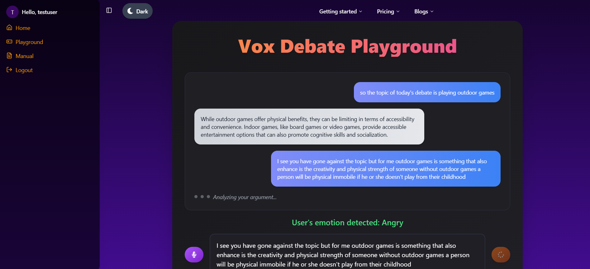
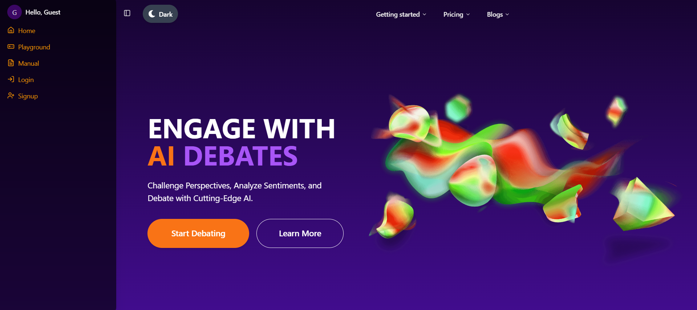
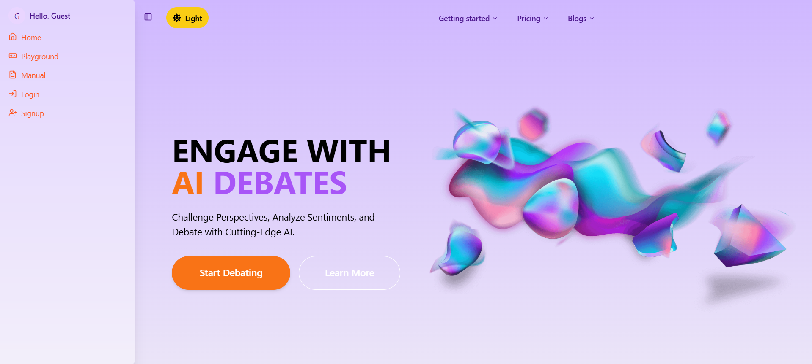
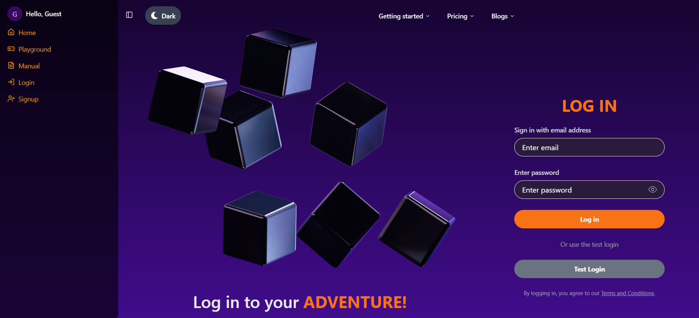
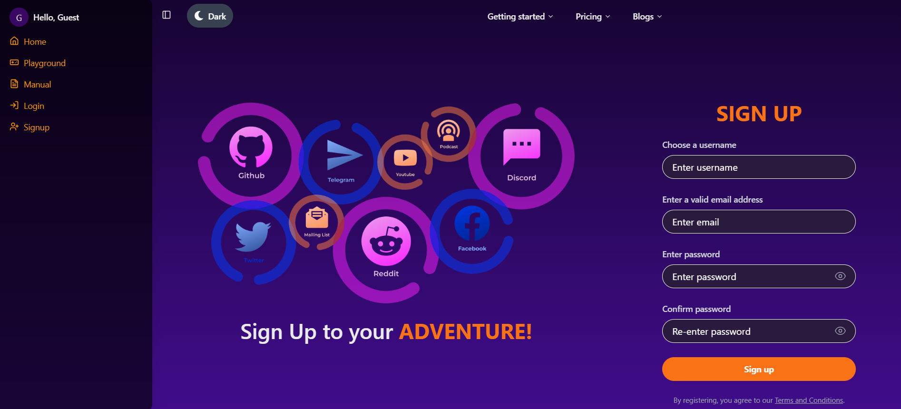

# VoxDebate - AI Debate Platform

VoxDebate is an innovative AI-powered debate platform built on the **MERN Stack**. It leverages advanced technologies, including Hugging Face's AI models and Google Gemini Pro, to create a seamless and intelligent debating experience. With its user-friendly interface, VoxDebate transforms the way users engage in meaningful discussions.

---

## 🚀 Features

### 🎙️ Voice Input and Emotion Analysis

- **Voice Recording**: Uses `react-speech-recognition` to record and transcribe speech in real-time.
- **Emotion Detection**: Integrates Hugging Face's [HuBERT Large Model](https://api-inference.huggingface.co/models/superb/hubert-large-superb-er) for voice sentiment analysis.
- **Emotion Display**: Displays the detected emotion alongside the AI's response.

### 📝 Real-Time Text Editing

- Users can edit the transcribed text before sending it to the AI for more precise interactions.

### 💬 Vox Debate Playground

- A chat-like interface designed for dynamic, engaging conversations with AI.
- Powered by **Google Gemini Pro** for intelligent and context-aware responses.

### 🌗 Dark and Light Mode

- Seamless integration using Redux Toolkit.

### 🎨 Responsive and Beautiful Design

- Built with **Tailwind CSS** and **shadcn-ui** for a polished user experience.
- Smooth transitions and animations powered by `framer-motion`.

### 🔒 Secure and Scalable Backend

- **User Authentication**: Managed using Context API and `jsonwebtoken`.
- **File Handling**: `multer` is used for handling uploads.
- **Database**: MongoDB and Mongoose provide robust data management.

### 📢 Notifications

- Instant feedback with `react-toastify`.

---

## 🛠️ Installation

1. Clone the repository:

   ```bash
   git clone https://github.com/hallowshaw/VoxDebate.git
   ```

2. Navigate to the project directory:

   ```bash
   cd VoxDebate
   ```

3. Install dependencies:
   - Frontend
   ```
   cd Frontend
   npm install
   npm i framer-motion lucide-react react react-dom react-icons react-redux react-router-dom react-speech-recognition react-toastify wav-encoder
   ```
   - Backend
   ```
   cd Backend
   npm install
   npm i @google/generative-ai axios bcrypt concurrently cookie-parser cors dotenv express jsonwebtoken mongodb mongoose multer nodemon prettier
   ```
4. Set up environment variables:

   - Create a .env file in the backend directory and replace with actual values

   ```
   PORT=8000
   MONGODB_URI=

   ACCESS_TOKEN_SECRET=

   ACCESS_TOKEN_EXPIRY=

   REFRESH_TOKEN_SECRET=
   REFRESH_TOKEN_EXPIRY=

   CORS_ORIGIN=*

   GOOGLE_API_KEY=

   HUGGINGFACE_API_KEY=
   ```

5. Run the application:
   - Frontend
   ```
   npm run dev
   ```
   - Backend
   ```
   npm run server
   ```
   - Use concurrently - for both Backend and Frontend
   ```
   cd Backend
   npm run dev
   ```

## 🖼️ Screenshots

Below are some screenshots of the application showcasing its features:

### Vox Debate Playground



### Homepage - Dark Mode



### Homepage - Light Mode



### Login Page



### Signup Page



## 🤝 Contribution

We welcome contributions! Please follow these steps:

1. Fork the repository.
2. Create a new branch:
   ```bash
   git checkout -b feature-name
   ```
3. Make your changes and commit them:
   ```
   git commit -m "Add feature-name"
   ```
4. Push your branch:
   ```
   git push origin feature-name
   ```
5. Open a Pull Request.

We’ll review your changes and merge them if everything checks out!

## 📄 License

This project is licensed under the **MIT License**.  
Feel free to use it, modify it, and share it while giving credit to the original creators.  
For more details, please see the [LICENSE](LICENSE) file.

---

## 🌟 Acknowledgments

A big thank you to:

- **Hugging Face** for their powerful AI models, which have been integrated for sentiment analysis.
- **Google** for providing the Gemini Pro model, which powers the intelligent responses in the debate platform.
- The open-source community for their amazing tools and libraries, which have made this project possible.

Thank you to everyone who contributes and helps make this project better. 🙏
